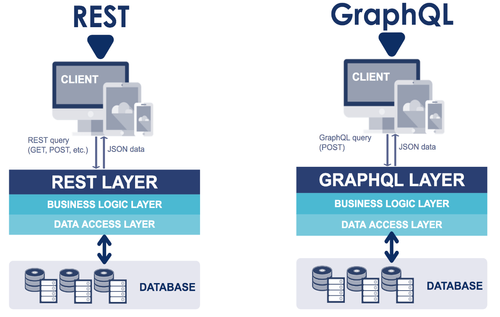

# GraphQL

## Language de requête

GraphQL est une spécification d'échange de données concurrente à la spécification REST.

<figure><figcaption></figcaption></figure>

L’environnement d’exécution de GraphQL qui interprète les requêtes GraphQL peut s'ajouter dans différents langages (NodeJS par exemple).

Le client choisit alors quels champs de chaque _Objet_ (ex: orders) il souhaite et dans quel ordre. La réponse du serveur GraphQL sera alors identique à l’ordre dans lequel a été formulé la requête.

<figure><figcaption>
à gauche la requête , à droite la réponse
</figcaption></figure>

## **Le schéma : Squelette de l’API**

Dans un second temps, GraphQL est un environnement d’exécution qui interpréte et structure ces requêtes à partir du schéma. \
\
Chaque schéma doit obligatoirement contenir les 2 types suivants :

* Query : ce type est utilisé pour fetch ou read des data depuis l'API
* Mutation : ce type est utilisé pour create,update ou delete de la data

On peut ensuite ajouter des types "custom" et y associés des champs avec différents types.

Exemple d'un type user et différents champs associés :&#x20;

.png>)\

Les types ID, String, Int, Bolean, ... sont des types par défaut de GraphQL

Il est également possible d'associé un champ à un type "custom" , ici job :&#x20;

<figure><figcaption></figcaption></figure>

<figure><figcaption></figcaption></figure>

Le point d'exclamation ! indique qu'un champ est requis.

Exemples de query :&#x20;

<figure><figcaption></figcaption></figure>

Exemples de mutations :&#x20;

<figure><figcaption></figcaption></figure>

Une Input est associée aux champs utilisés pour réaliser une mutation :&#x20;

<figure><figcaption></figcaption></figure>

\
En effet, après avoir vérifié que la requête correspond bien à la syntaxe du langage, le serveur GraphQL vérifie que la requête est bien disponible dans _Query_ (défini ci-dessous) et que les champs demandés correspondent bien au retour de la requête en question.

<figure><figcaption>
exemple de schéma
</figcaption></figure>

## **Les resolvers : Liaison avec le métier**

Une fois la requête vérifiée de part sa syntaxe et le schéma du serveur, GraphQL fait appel aux _resolvers_. Un _resolver_ associe une fonction de l’API (calculs, récupération de données de la base de données, appels à une autre API, etc...) à une requête ou une action définie dans les objets globaux du schéma, _Query_ et _Mutation_. C’est donc à ce niveau que l’on fait le lien entre les entrées des requêtes et les arguments des fonctions (_id_ dans l’exemple ci-dessous) mais aussi que l’on regroupe les règles de fonctionnement de notre API telle que l’authentification ou la gestion des droits.

<figure><figcaption>
<em>Rôle des resolvers dans une API GraphQL</em>
</figcaption></figure>

Considérons l’exemple ci dessus. Dans notre schéma nous avons défini sous _Query_ la requête _product_ sous réserve que l’utilisateur nous précise l’_id_ du produit qu’il souhaite. GraphQL, après avoir validé la requête, recherche dans resolvers la fonction associée, lui transmet l’argument _id_, récupère les données et enfin réorganise celles-ci (uniquement les champs demandés dans l’ordre demandé) pour que la réponse corresponde à la requête.

Liens :

[https://www.jesuisundev.com/comprendre-graphql-en-5-minutes/](https://www.jesuisundev.com/comprendre-graphql-en-5-minutes/)

[https://blog.octo.com/graphql-et-pourquoi-faire](https://blog.octo.com/graphql-et-pourquoi-faire)
